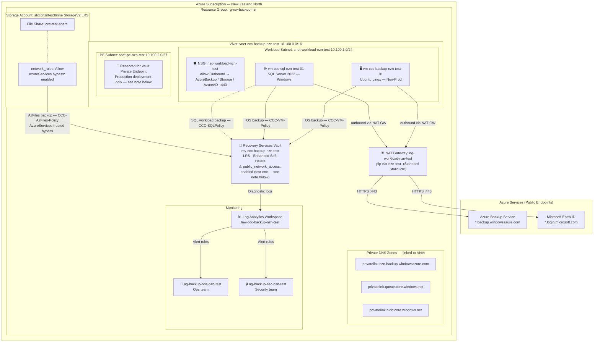

# Azure Backup – Terraform (CCC)

Terraform code to deploy Azure Backup infrastructure for **Christchurch City Council (CCC)** using [Azure Verified Modules (AVM)](https://aka.ms/avm).

---

## Table of Contents

1. [Overview](#overview)
2. [Architecture](#architecture)
3. [Prerequisites](#prerequisites)
4. [Repository Structure](#repository-structure)
5. [AVM Modules Used](#avm-modules-used)
6. [Resources Deployed](#resources-deployed)
7. [Backup Policies](#backup-policies)
8. [Monitoring & Alerting](#monitoring--alerting)
9. [Security & Vault Resiliency](#security--vault-resiliency)
10. [RBAC](#rbac)
11. [Getting Started](#getting-started)
12. [Variable Reference](#variable-reference)
13. [Outputs](#outputs)

---

## Overview

This Terraform project deploys a **non-production test environment** for Azure Backup based on the *Azure Backup Build Spec for Christchurch City Council*. It covers three workload types:

| Workload | Policy |
|---|---|
| Azure Virtual Machines (Non-Prod) | `CCC-Policy` (Enhanced V2) |
| SQL Server on Azure VMs | `CCC-SQLPolicy` |
| Azure File Shares | `CCC-AzFiles-Policy` |

All resources are deployed in **New Zealand North** (`newzealandnorth`) into a dedicated resource group `rg-rsv-backup-nzn`.

---

## Architecture

### Network Topology



---

### Outbound Connectivity — NAT Gateway vs Private Endpoint

The Azure Backup workload extension (`AzureBackupWindowsWorkload`) on the SQL VM must reach `*.backup.windowsazure.com` and `*.login.microsoft.com` over HTTPS. The NSG service tag rules permit those destinations, but **service tags only restrict which destinations are reachable — they do not create an outbound path**. Without a public IP, NAT Gateway, or private endpoint, all egress connections time out.

#### Option 1 — NAT Gateway *(current test environment)*

A Standard NAT Gateway (`ng-workload-nzn-test`) is attached to the workload subnet, providing outbound internet via `pip-nat-nzn-test`. Backup traffic is internet-routed but restricted to Azure service tag destinations by the NSG.

#### Option 2 — Private Endpoint *(recommended for production)*

[Microsoft docs confirm](https://learn.microsoft.com/en-us/azure/backup/backup-sql-server-database-azure-vms#private-endpoints) that private endpoints are the preferred connectivity method for SQL VM workload backup. With a vault private endpoint:

- `*.backup.windowsazure.com` resolves to a **private IP** in `snet-pe-nzn-test` via the pre-deployed DNS zones — no public DNS lookup.
- All backup traffic stays on the **Azure backbone** — no internet egress required.
- The NAT Gateway is not needed for backup connectivity with PE in place.
- Vault `public_network_access_enabled = false` can be enforced (the target state per the build spec).

> **Why this test vault has no private endpoint:**
>
> Azure enforces a hard constraint: **a private endpoint cannot be added to a Recovery Services vault that already has backup items registered**
> (`UserErrorMultiTenantVaultPrivateEndpointNotAllowed`). In this test environment, backup items
> were registered first (to run the test suite), which permanently blocks PE creation on this vault
> instance. The private DNS zones and PE subnet are fully deployed and ready — only the vault-level
> PE resource is blocked.

#### Production deployment order (required to use private endpoints)

Follow this exact sequence to avoid the constraint above:

1. Deploy the VNet, PE subnet (`snet-pe-nzn-test`), and private DNS zones.
2. Deploy the Recovery Services Vault with `public_network_access_enabled = false`.
3. **Create the vault private endpoint** (before registering any backup items).
4. Validate DNS resolution of `privatelink.nzn.backup.windowsazure.com` from the workload subnet.
5. Only then enable backup protection (VMs, SQL databases, file shares).

With this order the NAT Gateway is not required for backup workloads (though it remains useful for OS-level patching and other internet access from the workload VMs).

---

## Prerequisites

| Tool | Version | Notes |
|---|---|---|
| [Terraform](https://developer.hashicorp.com/terraform/install) | >= 1.9 | |
| [Azure CLI](https://learn.microsoft.com/cli/azure/install-azure-cli) | Latest | Used for authentication |
| Azure Subscription | — | Contributor or Owner permissions |

Authenticate before running Terraform:

```bash
az login
az account set --subscription "<subscription-id>"
```

---

## Repository Structure

```
AzureBackup-terraform/
├── providers.tf          # Terraform & AzureRM provider configuration
├── variables.tf          # All input variable declarations
├── locals.tf             # Naming, tag merging, RBAC map construction
├── main.tf               # Core AVM module calls (RG, LAW, RSV Vault)
├── backup_policies.tf    # Three backup policies (VM, SQL, AzFiles)
├── monitoring.tf         # Action groups and all alert rules
├── outputs.tf            # Exported resource IDs and names
├── terraform.tfvars      # ← Fill in your values here before deploying
├── doc.txt               # Source build specification document
└── README.md             # This file
```

---

## AVM Modules Used

| Module | Registry | Purpose |
|---|---|---|
| `Azure/avm-res-resources-resourcegroup/azurerm` | [Link](https://registry.terraform.io/modules/Azure/avm-res-resources-resourcegroup/azurerm) | Backup resource group |
| `Azure/avm-res-operationalinsights-workspace/azurerm` | [Link](https://registry.terraform.io/modules/Azure/avm-res-operationalinsights-workspace/azurerm) | Log Analytics workspace for backup telemetry |
| `Azure/avm-res-recoveryservices-vault/azurerm` | [Link](https://registry.terraform.io/modules/Azure/avm-res-recoveryservices-vault/azurerm) | Recovery Services vault with security controls |

> The three backup policies and all monitoring resources use native `azurerm` provider resources, as AVM does not currently publish sub-modules for these.

---

## Resources Deployed

| Resource Type | Name | Notes |
|---|---|---|
| Resource Group | `rg-rsv-backup-nzn` | Fixed name per spec |
| Recovery Services Vault | `rsv-ccc-backup-nzn-<env>` | LRS, Enhanced Soft Delete, public access off |
| Log Analytics Workspace | `law-ccc-backup-nzn-<env>` | 90-day retention (configurable) |
| Backup Policy (VM V2) | `CCC-Policy` | Enhanced V2, smart-tier archive enabled |
| Backup Policy (SQL) | `CCC-SQLPolicy` | Full + Differential; logs disabled |
| Backup Policy (Files) | `CCC-AzFiles-Policy` | Vault-Standard tier |
| Monitor Action Group | `ag-backup-ops-nzn-<env>` | Ops/on-call team |
| Monitor Action Group | `ag-backup-sec-nzn-<env>` | Security/platform team |
| Alert Rules | 8 rules | See [Monitoring & Alerting](#monitoring--alerting) |

---

## Backup Policies

### CCC-Policy — VM Non-Production (Enhanced V2)

| Setting | Value |
|---|---|
| Policy type | V2 (Enhanced) |
| Frequency | Daily |
| Backup time | 03:00 **NZST** |
| Daily retention | 7 days |
| Weekly retention | 2 weeks (Sunday) |
| Monthly retention | 1 month (First Sunday) |
| Archive/tiering | Smart-tier Recommended (simulates production archive behaviour) |
| Instant restore | 2 days |

### CCC-SQLPolicy — SQL Server on Azure VM

| Setting | Value |
|---|---|
| Workload type | SQLDataBase |
| Full backup | Weekly – Saturday 07:00 **NZST**, retain 4 weeks |
| Differential | Weekdays (Mon–Fri) 18:00 **NZST**, retain 14 days |
| Log backup | **Disabled** |

### CCC-AzFiles-Policy — Azure File Share

| Setting | Value |
|---|---|
| Backup tier | Vault-Standard |
| Frequency | Daily |
| Backup time | 22:00 **NZST** |
| Daily retention | 30 days |
| Monthly retention | 3 months (First Sunday) |
| Yearly retention | 1 year (January – First Sunday) |

> All times are specified in **New Zealand Standard Time** (`New Zealand Standard Time` Windows timezone = UTC+12).

---

## Monitoring & Alerting

Two action groups route alerts to different teams:

| Action Group | Routes to | Triggered by |
|---|---|---|
| `ag-backup-ops-*` | Backup operations / on-call | Backup failures, health events, storage growth, resource health |
| `ag-backup-sec-*` | Security / platform engineering | Admin operations (delete vault, PE approval, job export, security PIN) |

### Alert Rules Summary

| Alert Name | Type | Trigger | Severity |
|---|---|---|---|
| Failed Jobs | Log Analytics (query) | Any job failure in last 30 min | Sev 1 |
| Storage Per Item | Log Analytics (query) | Single item > 500 GB | Sev 2 |
| Total Storage Trend | Log Analytics (query) | Total vault storage > 1 TB | Sev 2 |
| Backup Health Events | Metric | Non-Healthy backup health event | Sev 1 |
| Restore Health Events | Metric | Non-Healthy restore health event | Sev 1 |
| Resource Health | Activity Log | Vault Degraded / Unavailable | — |
| Admin: Delete Vault | Activity Log | `vaults/delete` called | → Security AG |
| Admin: Approve PE | Activity Log | Private endpoint connection write | → Security AG |
| Admin: Export Jobs | Activity Log | Job export action triggered | → Security AG |
| Admin: Security PIN | Activity Log | Security PIN retrieved | → Security AG |

---

## Security & Vault Resiliency

Settings applied to the non-production vault (per spec):

| Control | Non-Prod Setting | How to Change |
|---|---|---|
| Storage redundancy | **LRS** | Change `storage_mode_type` in `main.tf` to `ZoneRedundant` for prod |
| Encryption at rest | Microsoft-managed keys | CMK requires additional key vault setup |
| Enhanced Soft Delete | **AlwaysON** (cannot be disabled once set) | Mandatory baseline — do not change |
| Vault immutability | **Disabled** | Set `enable_immutability = true` in `terraform.tfvars` |
| Multi-User Authorization | Not configured (optional for non-prod) | Add manually in portal or extend module config |
| Public network access | **Disabled** | Always off — vault reachable only via private endpoint |
| Security PIN (critical ops) | Optional for non-prod | Enable via vault security settings in portal |

---

## RBAC

Four roles are assignable via variables. Supply Entra ID object IDs (users or groups) in `terraform.tfvars`:

| Role | Variable | Purpose |
|---|---|---|
| Backup Contributor | `backup_contributor_principal_ids` | Configure backup, manage protection, run jobs, restore |
| Backup Operator | `backup_operator_principal_ids` | Trigger restores, monitor jobs, operational actions |
| Backup Reader | `backup_reader_principal_ids` | Read-only: jobs, policies, health (auditors, app owners) |
| Recovery Services Contributor | `rsv_contributor_principal_ids` | Vault-level administration (platform team) |

---

## Getting Started

### 1. Clone / open the folder

```powershell
cd "AzureBackup-terraform"
```

### 2. Fill in terraform.tfvars

Open [terraform.tfvars](terraform.tfvars) and replace all `TODO` values:

```hcl
subscription_id = "<your-subscription-id>"

# Optional — leave empty to skip private endpoint for initial test
private_endpoint_subnet_id = ""

# Alert recipients
alert_email_receivers          = ["backup-ops@ccc.govt.nz"]
alert_email_receivers_security = ["platform-security@ccc.govt.nz"]

# RBAC – Entra ID object IDs
backup_contributor_principal_ids = ["<object-id>"]
```

### 3. Initialise Terraform

```bash
terraform init
```

### 4. Review the plan

```bash
terraform plan
```

### 5. Apply

```bash
terraform apply
```

### 6. Destroy (test environment teardown)

```bash
terraform destroy
```

> **Note:** Because `soft_delete_feature_state = "AlwaysON"` (Enhanced Soft Delete), you must unregister all backup items from the vault before destroy will succeed. Alternatively, set `prevent_recovery_services_soft_delete = false` in the provider block (already done) and ensure no active backup items exist in the vault.

---

## Variable Reference

| Variable | Type | Default | Description |
|---|---|---|---|
| `subscription_id` | `string` | — | **Required.** Azure subscription ID |
| `location` | `string` | `newzealandnorth` | Azure region |
| `environment` | `string` | `test` | Environment label used in resource names |
| `workload` | `string` | `backup` | Workload label used in resource names |
| `private_endpoint_subnet_id` | `string` | `""` | Subnet resource ID for vault private endpoint (leave empty to skip) |
| `private_dns_zone_ids` | `list(string)` | `[]` | Private DNS zone IDs for PE registration |
| `log_analytics_retention_days` | `number` | `90` | LAW retention in days (30–730) |
| `enable_immutability` | `bool` | `false` | Enables Unlocked vault immutability |
| `backup_contributor_principal_ids` | `list(string)` | `[]` | Entra object IDs for Backup Contributor |
| `backup_operator_principal_ids` | `list(string)` | `[]` | Entra object IDs for Backup Operator |
| `backup_reader_principal_ids` | `list(string)` | `[]` | Entra object IDs for Backup Reader |
| `rsv_contributor_principal_ids` | `list(string)` | `[]` | Entra object IDs for Recovery Services Contributor |
| `alert_email_receivers` | `list(string)` | `[]` | Email addresses for ops action group |
| `alert_email_receivers_security` | `list(string)` | `[]` | Email addresses for security action group |
| `tags` | `map(string)` | `{}` | Additional tags merged with defaults |

---

## Outputs

| Output | Description |
|---|---|
| `resource_group_name` | Name of the backup resource group |
| `resource_group_id` | Resource ID of the backup resource group |
| `log_analytics_workspace_id` | Resource ID of the Log Analytics workspace |
| `log_analytics_workspace_name` | Name of the Log Analytics workspace |
| `recovery_services_vault_id` | Resource ID of the Recovery Services vault |
| `recovery_services_vault_name` | Name of the Recovery Services vault |
| `backup_policy_vm_nonprod_id` | Resource ID of `CCC-Policy` (VM non-prod) |
| `backup_policy_sql_id` | Resource ID of `CCC-SQLPolicy` |
| `backup_policy_azfiles_id` | Resource ID of `CCC-AzFiles-Policy` |
| `action_group_ops_id` | Resource ID of the ops action group |
| `action_group_security_id` | Resource ID of the security action group |
