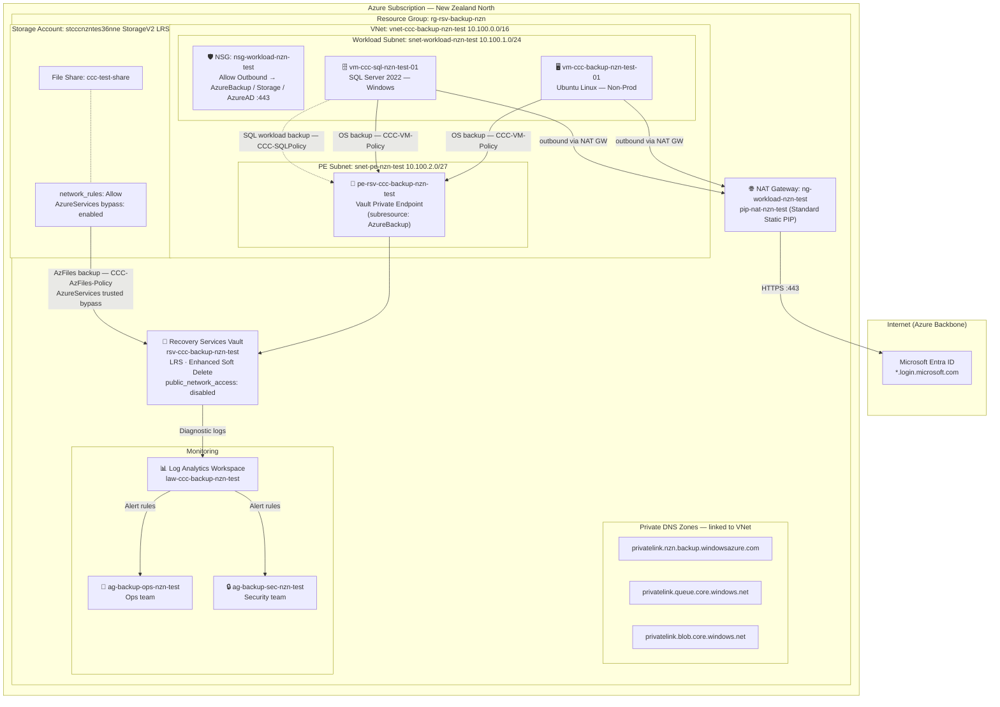

# Azure Backup – Terraform (CCC)

Terraform code to deploy Azure Backup infrastructure for **Christchurch City Council (CCC)** using [Azure Verified Modules (AVM)](https://aka.ms/avm).

---

## Table of Contents

1. [Overview](#overview)
2. [Architecture](#architecture)
3. [Prerequisites](#prerequisites)
4. [Repository Structure](#repository-structure)
5. [AVM Modules Used](#avm-modules-used)
6. [Resources Deployed](#resources-deployed)
7. [Backup Policies](#backup-policies)
8. [Monitoring & Alerting](#monitoring--alerting)
9. [Security & Vault Resiliency](#security--vault-resiliency)
10. [RBAC](#rbac)
11. [Getting Started](#getting-started)
12. [Variable Reference](#variable-reference)
13. [Outputs](#outputs)

---

## Overview

This Terraform project deploys a **non-production test environment** for Azure Backup based on the *Azure Backup Build Spec for Christchurch City Council*. It covers three workload types:

| Workload | Policy |
|---|---|
| Azure Virtual Machines (Non-Prod) | `CCC-Policy` (Enhanced V2) |
| SQL Server on Azure VMs | `CCC-SQLPolicy` |
| Azure File Shares | `CCC-AzFiles-Policy` |

All resources are deployed in **New Zealand North** (`newzealandnorth`) into a dedicated resource group `rg-rsv-backup-nzn`.

---

## Architecture

### Network Topology



---

### Outbound Connectivity

Backup traffic and general VM internet access use different paths:

#### Backup — Private Endpoint

All backup workloads (VM, SQL, Azure Files) communicate with the vault via the private endpoint `pe-rsv-ccc-backup-nzn-test` in `snet-pe-nzn-test`. DNS resolution for `*.backup.windowsazure.com`, `*.queue.core.windows.net`, and `*.blob.core.windows.net` is handled by the three linked private DNS zones, resolving to private IPs within the VNet. No internet egress is required for backup traffic.

This satisfies the build spec requirement of `public_network_access_enabled = false` on the vault and is the [recommended connectivity model](https://learn.microsoft.com/en-us/azure/backup/backup-sql-server-database-azure-vms#private-endpoints) for SQL VM workload backup.

#### General VM Internet — NAT Gateway

The Standard NAT Gateway (`ng-workload-nzn-test`) on the workload subnet provides outbound internet for OS-level operations. Even though all backup *data* flows over the Microsoft backbone via the private endpoint, the VMs still require outbound internet access for traffic that has no private endpoint equivalent:

| Traffic | Destination | Why no private endpoint? |
|---|---|---|
| TLS certificate revocation (CRL/OCSP) | `crl.microsoft.com`, `ocsp.digicert.com`, `crl3/4.digicert.com` | Public CRL endpoints — not routable privately. The Backup agent and SQL IaaS extension validate TLS certificates on every connection. |
| Azure VM extension installation | `download.microsoft.com` (Microsoft CDN) | Extension packages (`MicrosoftAzureRecoveryServices`, `SqlIaasExtension`, `VMSnapshot`) are pulled from a public CDN at provisioning time. |
| Azure Backup agent heartbeat & registration | `*.backup.windowsazure.com` | The vault private endpoint covers backup/restore data transfer, but the Backup extension's initial agent registration and periodic heartbeat still use public service endpoints. |
| SQL IaaS Extension agent | `*.agentsvc.azure-automation.net`, `*.ods.opinsights.azure.com` | SQL VM management traffic sent by `SqlIaasExtension`; these endpoints do not have private endpoint support in all regions. |
| Windows Update / OS patching | `windowsupdate.microsoft.com` and Microsoft CDN | Required for automated OS patching (observed in activity log). |

The NSG on the workload subnet restricts the permitted destinations to the `AzureBackup`, `Storage`, and `AzureActiveDirectory` service tags on port 443 only, limiting the blast radius of the outbound path.

> **Production hardening:** Replace the NAT gateway with an **Azure Firewall** (or equivalent NVA) with explicit FQDN allow-rules for the endpoints above. This gives full L7 visibility and prevents any unexpected outbound traffic.

#### Required Deployment Order

Azure blocks adding a private endpoint to a vault that already has backup items registered (`UserErrorMultiTenantVaultPrivateEndpointNotAllowed`). This Terraform config deploys in the correct sequence to avoid that constraint:

1. VNet, PE subnet, and private DNS zones.
2. Recovery Services Vault with `public_network_access_enabled = false`.
3. Vault private endpoint — created before any backup protection is enabled.
4. Backup protection for VMs, SQL databases, and file shares.

---

## Prerequisites

| Tool | Version | Notes |
|---|---|---|
| [Terraform](https://developer.hashicorp.com/terraform/install) | >= 1.9 | |
| [Azure CLI](https://learn.microsoft.com/cli/azure/install-azure-cli) | Latest | Used for authentication |
| Azure Subscription | — | Contributor or Owner permissions |

Authenticate before running Terraform:

```bash
az login
az account set --subscription "<subscription-id>"
```

---

## Repository Structure

```
AzureBackup-terraform/
├── providers.tf          # Terraform & AzureRM provider configuration
├── variables.tf          # All input variable declarations
├── locals.tf             # Naming, tag merging, RBAC map construction
├── main.tf               # Core AVM module calls (RG, LAW, RSV Vault)
├── backup_policies.tf    # Three backup policies (VM, SQL, AzFiles)
├── monitoring.tf         # Action groups and all alert rules
├── outputs.tf            # Exported resource IDs and names
├── terraform.tfvars      # ← Fill in your values here before deploying
├── doc.txt               # Source build specification document
└── README.md             # This file
```

---

## AVM Modules Used

| Module | Registry | Purpose |
|---|---|---|
| `Azure/avm-res-resources-resourcegroup/azurerm` | [Link](https://registry.terraform.io/modules/Azure/avm-res-resources-resourcegroup/azurerm) | Backup resource group |
| `Azure/avm-res-operationalinsights-workspace/azurerm` | [Link](https://registry.terraform.io/modules/Azure/avm-res-operationalinsights-workspace/azurerm) | Log Analytics workspace for backup telemetry |
| `Azure/avm-res-recoveryservices-vault/azurerm` | [Link](https://registry.terraform.io/modules/Azure/avm-res-recoveryservices-vault/azurerm) | Recovery Services vault with security controls |

> The three backup policies and all monitoring resources use native `azurerm` provider resources, as AVM does not currently publish sub-modules for these.

---

## Resources Deployed

| Resource Type | Name | Notes |
|---|---|---|
| Resource Group | `rg-rsv-backup-nzn` | Fixed name per spec |
| Recovery Services Vault | `rsv-ccc-backup-nzn-<env>` | LRS, Enhanced Soft Delete, public access disabled |
| Private Endpoint | `pe-rsv-ccc-backup-nzn-<env>` | In `snet-pe-nzn-test`, subresource `AzureBackup` |
| Log Analytics Workspace | `law-ccc-backup-nzn-<env>` | 90-day retention (configurable) |
| Backup Policy (VM V2) | `CCC-Policy` | Enhanced V2, smart-tier archive enabled |
| Backup Policy (SQL) | `CCC-SQLPolicy` | Full + Differential; logs disabled |
| Backup Policy (Files) | `CCC-AzFiles-Policy` | Vault-Standard tier |
| Monitor Action Group | `ag-backup-ops-nzn-<env>` | Ops/on-call team |
| Monitor Action Group | `ag-backup-sec-nzn-<env>` | Security/platform team |
| Alert Rules | 8 rules | See [Monitoring & Alerting](#monitoring--alerting) |

---

## Backup Policies

### CCC-Policy — VM Non-Production (Enhanced V2)

| Setting | Value |
|---|---|
| Policy type | V2 (Enhanced) |
| Frequency | Daily |
| Backup time | 03:00 **NZST** |
| Daily retention | 7 days |
| Weekly retention | 2 weeks (Sunday) |
| Monthly retention | 1 month (First Sunday) |
| Archive/tiering | Smart-tier Recommended (simulates production archive behaviour) |
| Instant restore | 2 days |

### CCC-SQLPolicy — SQL Server on Azure VM

| Setting | Value |
|---|---|
| Workload type | SQLDataBase |
| Full backup | Weekly – Saturday 07:00 **NZST**, retain 4 weeks |
| Differential | Weekdays (Mon–Fri) 18:00 **NZST**, retain 14 days |
| Log backup | **Disabled** |

### CCC-AzFiles-Policy — Azure File Share

| Setting | Value |
|---|---|
| Backup tier | Vault-Standard |
| Frequency | Daily |
| Backup time | 22:00 **NZST** |
| Daily retention | 30 days |
| Monthly retention | 3 months (First Sunday) |
| Yearly retention | 1 year (January – First Sunday) |

> All times are specified in **New Zealand Standard Time** (`New Zealand Standard Time` Windows timezone = UTC+12).

---

## Monitoring & Alerting

Two action groups route alerts to different teams:

| Action Group | Routes to | Triggered by |
|---|---|---|
| `ag-backup-ops-*` | Backup operations / on-call | Backup failures, health events, storage growth, resource health |
| `ag-backup-sec-*` | Security / platform engineering | Admin operations (delete vault, PE approval, job export, security PIN) |

### Alert Rules Summary

| Alert Name | Type | Trigger | Severity |
|---|---|---|---|
| Failed Jobs | Log Analytics (query) | Any job failure in last 30 min | Sev 1 |
| Storage Per Item | Log Analytics (query) | Single item > 500 GB | Sev 2 |
| Total Storage Trend | Log Analytics (query) | Total vault storage > 1 TB | Sev 2 |
| Backup Health Events | Metric | Non-Healthy backup health event | Sev 1 |
| Restore Health Events | Metric | Non-Healthy restore health event | Sev 1 |
| Resource Health | Activity Log | Vault Degraded / Unavailable | — |
| Admin: Delete Vault | Activity Log | `vaults/delete` called | → Security AG |
| Admin: Approve PE | Activity Log | Private endpoint connection write | → Security AG |
| Admin: Export Jobs | Activity Log | Job export action triggered | → Security AG |
| Admin: Security PIN | Activity Log | Security PIN retrieved | → Security AG |

---

## Security & Vault Resiliency

Settings applied to the non-production vault (per spec):

| Control | Non-Prod Setting | How to Change |
|---|---|---|
| Storage redundancy | **LRS** | Change `storage_mode_type` in `main.tf` to `ZoneRedundant` for prod |
| Encryption at rest | Microsoft-managed keys | CMK requires additional key vault setup |
| Enhanced Soft Delete | **AlwaysON** (cannot be disabled once set) | Mandatory baseline — do not change |
| Vault immutability | **Disabled** | Set `enable_immutability = true` in `terraform.tfvars` |
| Multi-User Authorization | Not configured (optional for non-prod) | Add manually in portal or extend module config |
| Public network access | **Disabled** | Always off — vault reachable only via private endpoint |
| Security PIN (critical ops) | Optional for non-prod | Enable via vault security settings in portal |

---

## RBAC

Four roles are assignable via variables. Supply Entra ID object IDs (users or groups) in `terraform.tfvars`:

| Role | Variable | Purpose |
|---|---|---|
| Backup Contributor | `backup_contributor_principal_ids` | Configure backup, manage protection, run jobs, restore |
| Backup Operator | `backup_operator_principal_ids` | Trigger restores, monitor jobs, operational actions |
| Backup Reader | `backup_reader_principal_ids` | Read-only: jobs, policies, health (auditors, app owners) |
| Recovery Services Contributor | `rsv_contributor_principal_ids` | Vault-level administration (platform team) |

---

## Getting Started

### 1. Clone / open the folder

```powershell
cd "AzureBackup-terraform"
```

### 2. Fill in terraform.tfvars

Open [terraform.tfvars](terraform.tfvars) and replace all `TODO` values:

```hcl
subscription_id = "<your-subscription-id>"

# Alert recipients
alert_email_receivers          = ["backup-ops@ccc.govt.nz"]
alert_email_receivers_security = ["platform-security@ccc.govt.nz"]

# RBAC – Entra ID object IDs
backup_contributor_principal_ids = ["<object-id>"]
```

### 3. Initialise Terraform

```bash
terraform init
```

### 4. Review the plan

```bash
terraform plan
```

### 5. Apply

```bash
terraform apply
```

### 6. Destroy (test environment teardown)

```bash
terraform destroy
```

> **Note:** Enhanced Soft Delete (`AlwaysON`) means all backup items must be unregistered and their recovery points deleted before `terraform destroy` will succeed on the vault. Disable soft delete via the vault security settings, delete all protected items and recovery points, then run destroy.

---

## Variable Reference

| Variable | Type | Default | Description |
|---|---|---|---|
| `subscription_id` | `string` | — | **Required.** Azure subscription ID |
| `location` | `string` | `newzealandnorth` | Azure region |
| `environment` | `string` | `test` | Environment label used in resource names |
| `workload` | `string` | `backup` | Workload label used in resource names |
| `private_endpoint_subnet_id` | `string` | `""` | Subnet resource ID for vault private endpoint (leave empty to skip) |
| `private_dns_zone_ids` | `list(string)` | `[]` | Private DNS zone IDs for PE registration |
| `log_analytics_retention_days` | `number` | `90` | LAW retention in days (30–730) |
| `enable_immutability` | `bool` | `false` | Enables Unlocked vault immutability |
| `backup_contributor_principal_ids` | `list(string)` | `[]` | Entra object IDs for Backup Contributor |
| `backup_operator_principal_ids` | `list(string)` | `[]` | Entra object IDs for Backup Operator |
| `backup_reader_principal_ids` | `list(string)` | `[]` | Entra object IDs for Backup Reader |
| `rsv_contributor_principal_ids` | `list(string)` | `[]` | Entra object IDs for Recovery Services Contributor |
| `alert_email_receivers` | `list(string)` | `[]` | Email addresses for ops action group |
| `alert_email_receivers_security` | `list(string)` | `[]` | Email addresses for security action group |
| `tags` | `map(string)` | `{}` | Additional tags merged with defaults |

---

## Outputs

| Output | Description |
|---|---|
| `resource_group_name` | Name of the backup resource group |
| `resource_group_id` | Resource ID of the backup resource group |
| `log_analytics_workspace_id` | Resource ID of the Log Analytics workspace |
| `log_analytics_workspace_name` | Name of the Log Analytics workspace |
| `recovery_services_vault_id` | Resource ID of the Recovery Services vault |
| `recovery_services_vault_name` | Name of the Recovery Services vault |
| `backup_policy_vm_nonprod_id` | Resource ID of `CCC-Policy` (VM non-prod) |
| `backup_policy_sql_id` | Resource ID of `CCC-SQLPolicy` |
| `backup_policy_azfiles_id` | Resource ID of `CCC-AzFiles-Policy` |
| `action_group_ops_id` | Resource ID of the ops action group |
| `action_group_security_id` | Resource ID of the security action group |
